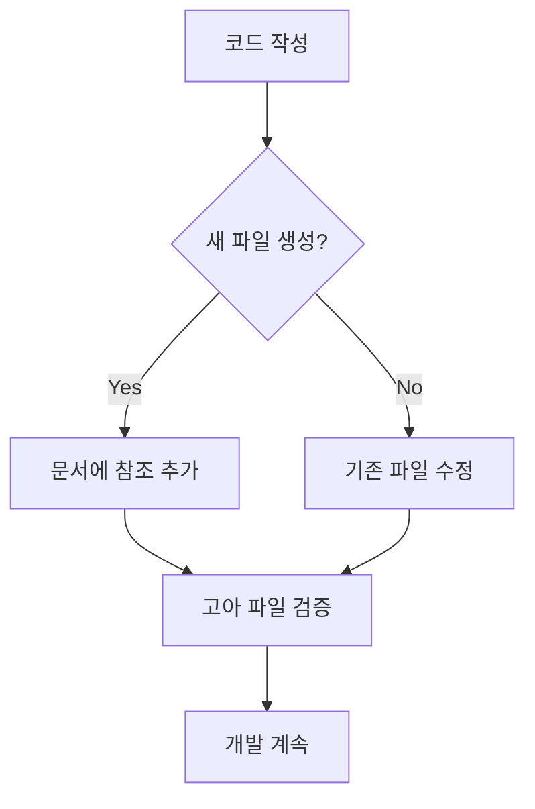
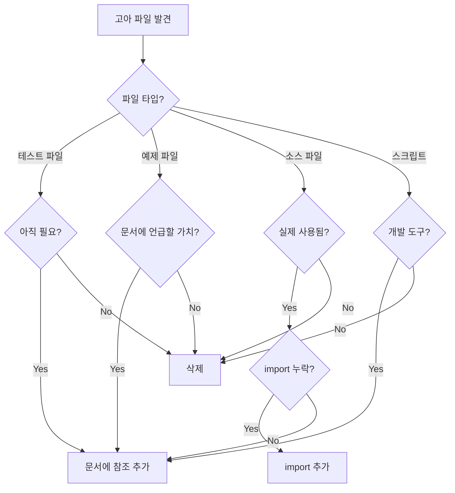

# mdoc-tools 워크플로우 가이드

## 목차
1. [일일 개발 워크플로우](#일일-개발-워크플로우)
2. [기능 추가 워크플로우](#기능-추가-워크플로우)
3. [코드베이스 정리 워크플로우](#코드베이스-정리-워크플로우)
4. [문서 마이그레이션 워크플로우](#문서-마이그레이션-워크플로우)
5. [CI/CD 통합 워크플로우](#cicd-통합-워크플로우)
6. [리팩토링 워크플로우](#리팩토링-워크플로우)

---

## 일일 개발 워크플로우

### 개발 시작 전

```bash
# 1. 현재 상태 확인
mdoc validate all

# 2. 작업할 기능 문서 확인
cat tasks/features/XX_FeatureName.md
```

### 코드 작성 중



**실행 명령**:
```bash
# 새 파일 생성 시마다
mdoc validate orphans

# 결과 확인 및 문서 업데이트
vim tasks/features/XX_FeatureName.md
# code_references에 새 파일 추가
```

### 개발 완료 후

```bash
# 1. 전체 검증
mdoc validate all

# 2. 문제 발견 시 수정
#    - 고아 파일: 문서에 참조 추가 또는 파일 삭제
#    - 네이밍 오류: 파일명 수정
#    - 마이그레이션 오류: tasks-v2 업데이트

# 3. Git 커밋
git add .
git commit -m "feat: implement feature"
```

---

## 기능 추가 워크플로우

### Phase 1: 기획 및 문서 작성

```bash
# 1. 기능 번호 확인
ls tasks/features/ | tail -1
# 예: 10_Export.md → 다음은 11

# 2. 기능 문서 생성
vim tasks/features/11_NewFeature.md
```

**문서 템플릿**:
```markdown
---
entry_point: ""
code_references:
  - ""
type: "feature"
status: "planning"
---

# 11. New Feature

## 개요
[기능 설명]

## 요구사항
- [ ] 요구사항 1
- [ ] 요구사항 2

## 인터페이스
- [XX--YY](../interfaces/XX--YY.md): [설명]

## 코드 구조
```

### Phase 2: 인터페이스 정의

```bash
# 1. 필요한 인터페이스 확인
# 예: Component 03과 05 사이 통신 필요

# 2. 인터페이스 문서 생성 (네이밍 주의!)
vim tasks/interfaces/03--05.md  # ✅ 작은 숫자가 앞

# 3. 네이밍 검증
mdoc validate naming
```

**인터페이스 템플릿**:
```markdown
---
from: "03"
to: "05"
type: "service"
status: "defined"
---

# 03--05 인터페이스

## 설명
Canvas(03)와 Database(05) 간의 데이터 통신

## 메서드
- `saveCanvasState()`: 캔버스 상태 저장
- `loadCanvasState()`: 캔버스 상태 불러오기

## 이벤트
- `canvasSaved`: 저장 완료 시 발생
```

### Phase 3: 공유 타입 정의 (필요 시)

```bash
# 1. 여러 인터페이스에서 사용되는 타입 확인
# 예: 03--05와 05--06에서 같은 타입 사용

# 2. 공유 타입 문서 생성 (쌍 정렬 주의!)
vim tasks/shared/03--05_05--06.md  # ✅ 쌍 정렬됨

# 3. 네이밍 검증
mdoc validate naming
```

**공유 타입 템플릿**:
```markdown
---
interfaces:
  - "03--05"
  - "05--06"
type: "shared"
status: "defined"
---

# 03--05_05--06 공용 타입

## 타입 정의

### CanvasData
```typescript
interface CanvasData {
  id: string;
  layers: Layer[];
  metadata: Metadata;
}
```

## 사용처
- [03--05](../interfaces/03--05.md): Canvas → Database
- [05--06](../interfaces/05--06.md): Database → CanvasData
```

### Phase 4: 구현

```bash
# 1. 코드 작성
# src/features/NewFeature.tsx
# src/services/NewFeatureService.ts
# ...

# 2. 실시간 고아 파일 체크
mdoc validate orphans

# 3. 문서 업데이트
vim tasks/features/11_NewFeature.md
```

**code_references 추가**:
```markdown
---
entry_point: "src/features/NewFeature.tsx"
code_references:
  - "src/features/NewFeature.tsx"
  - "src/services/NewFeatureService.ts"
  - "src/components/NewFeaturePanel.tsx"
  - "src/hooks/useNewFeature.ts"
type: "feature"
status: "implemented"
---
```

### Phase 5: 검증 및 완료

```bash
# 1. 전체 검증
mdoc validate all

# 2. 상태 업데이트
vim tasks/features/11_NewFeature.md
# status: "implemented" → status: "completed"

# 3. 커밋
git add .
git commit -m "feat: add new feature with complete documentation"
```

---

## 코드베이스 정리 워크플로우

### 매주 정기 정리

```bash
# 1. 고아 파일 탐색
mdoc validate orphans > orphans_report.txt

# 2. 리포트 검토
cat orphans_report.txt
```

### 고아 파일 처리 결정 트리



### 단계별 처리

```bash
# 1. 테스트 파일 확인
grep "test-" orphans_report.txt
# → 삭제 또는 tasks/tests/README.md에 문서화

# 2. 예제 파일 확인
grep "example\|Example" orphans_report.txt
# → 기능 문서의 code_references에 추가 또는 삭제

# 3. 소스 파일 확인
grep "src/" orphans_report.txt
# → 사용처 조사 후 판단

# 4. 처리 실행
git rm test-obsolete.ts
vim tasks/features/03_Canvas.md  # code_references 추가

# 5. 재검증
mdoc validate orphans
```

---

## 문서 마이그레이션 워크플로우

### Phase 1: 마이그레이션 계획

```bash
# 1. 현재 상태 확인
mdoc validate migration --markdown
# → MIGRATION_REPORT.md 생성

# 2. 리포트 분석
cat tasks-v2/MIGRATION_REPORT.md

# 3. 우선순위 설정
#    - Critical: 누락된 entry_point, 핵심 섹션
#    - High: 주요 타입 정의
#    - Medium: 부가 섹션
#    - Low: 예제, 참고사항
```

### Phase 2: 순차 마이그레이션

```bash
# 1. Features 마이그레이션
for file in tasks/features/*.md; do
  echo "Processing $file"

  # tasks-v2로 복사
  cp "$file" "tasks-v2/features/"

  # 섹션 검증
  mdoc validate migration

  # 문제 발견 시 수정
  vim "tasks-v2/features/$(basename $file)"
done

# 2. Interfaces 마이그레이션
for file in tasks/interfaces/*.md; do
  echo "Processing $file"

  # 네이밍 검증 먼저
  mdoc validate naming

  # tasks-v2로 복사
  cp "$file" "tasks-v2/interfaces/"

  # 검증
  mdoc validate migration
done

# 3. Shared Types 마이그레이션
for file in tasks/shared/*.md; do
  echo "Processing $file"

  # 네이밍 및 frontmatter 검증
  mdoc validate naming

  # tasks-v2로 복사
  cp "$file" "tasks-v2/shared/"

  # 검증
  mdoc validate migration
done
```

### Phase 3: 검증 및 완료

```bash
# 1. 전체 마이그레이션 검증
mdoc validate migration

# 2. 모든 검증 실행
mdoc validate all

# 3. 문서 정리
# - tasks/ 백업
# - tasks-v2/ → tasks/ 이동
# - 또는 병행 운영
```

---

## CI/CD 통합 워크플로우

### GitHub Actions 예시

```yaml
# .github/workflows/docs-validation.yml
name: Documentation Validation

on:
  push:
    branches: [main, develop]
  pull_request:
    branches: [main, develop]

jobs:
  validate-docs:
    runs-on: ubuntu-latest

    steps:
      - uses: actions/checkout@v3

      - name: Setup Bun
        uses: oven-sh/setup-bun@v1
        with:
          bun-version: latest

      - name: Install mdoc-tools
        run: |
          cd mdoc-tools
          bun install
          bun run build

      - name: Validate Naming Conventions
        run: ./mdoc-tools/dist/cli.js validate naming

      - name: Validate Orphan Files
        run: ./mdoc-tools/dist/cli.js validate orphans

      - name: Validate Migration (if applicable)
        run: |
          if [ -d "tasks-v2" ]; then
            ./mdoc-tools/dist/cli.js validate migration --markdown
            cat tasks-v2/MIGRATION_REPORT.md >> $GITHUB_STEP_SUMMARY
          fi

      - name: Full Validation
        run: ./mdoc-tools/dist/cli.js validate all
```

### Pre-commit Hook

```bash
# .husky/pre-commit
#!/bin/sh

# 고아 파일 검증 (경고만, 커밋 차단 안 함)
echo "🔍 Checking for orphan files..."
./mdoc-tools/dist/cli.js validate orphans || echo "⚠️  Warning: Orphan files detected"

# 네이밍 컨벤션 검증 (커밋 차단)
echo "📝 Validating naming conventions..."
./mdoc-tools/dist/cli.js validate naming || exit 1

# 린터 실행
npm run lint:fix
```

### Pre-push Hook

```bash
# .husky/pre-push
#!/bin/sh

echo "🔄 Running full validation before push..."

# 전체 검증 실행
./mdoc-tools/dist/cli.js validate all

if [ $? -ne 0 ]; then
  echo "❌ Validation failed. Fix issues before pushing."
  exit 1
fi

echo "✅ All validations passed!"
```

---

## 리팩토링 워크플로우

### Phase 1: 계획

```bash
# 1. 현재 상태 스냅샷
mdoc validate all > pre_refactor_report.txt

# 2. 영향 받는 문서 확인
grep -r "OldFileName" tasks/

# 3. 리팩토링 계획 문서화
vim REFACTORING_PLAN.md
```

### Phase 2: 실행

```bash
# 1. 파일 이동/이름 변경
git mv src/old/path.ts src/new/path.ts

# 2. 문서 업데이트
vim tasks/features/03_Canvas.md
# code_references 경로 수정

# 3. 실시간 검증
mdoc validate orphans
```

### Phase 3: 검증

```bash
# 1. 고아 파일 확인 (이전 경로가 고아가 되었는지)
mdoc validate orphans

# 2. 전체 검증
mdoc validate all

# 3. 이전 상태와 비교
mdoc validate all > post_refactor_report.txt
diff pre_refactor_report.txt post_refactor_report.txt
```

---

## 자동화 스크립트 예시

### 새 기능 스캐폴딩

```bash
#!/bin/bash
# scripts/new-feature.sh

FEATURE_NUM=$1
FEATURE_NAME=$2

if [ -z "$FEATURE_NUM" ] || [ -z "$FEATURE_NAME" ]; then
  echo "Usage: ./new-feature.sh <number> <name>"
  echo "Example: ./new-feature.sh 11 MultiSelection"
  exit 1
fi

# 1. 기능 문서 생성
cat > "tasks/features/${FEATURE_NUM}_${FEATURE_NAME}.md" <<EOF
---
entry_point: ""
code_references: []
type: "feature"
status: "planning"
---

# ${FEATURE_NUM}. ${FEATURE_NAME}

## 개요

## 요구사항

## 인터페이스

## 코드 구조
EOF

echo "✅ Created tasks/features/${FEATURE_NUM}_${FEATURE_NAME}.md"

# 2. 디렉토리 생성
mkdir -p "src/features/${FEATURE_NAME}"
echo "✅ Created src/features/${FEATURE_NAME}/"

# 3. 검증
./mdoc-tools/dist/cli.js validate all
```

### 고아 파일 자동 삭제

```bash
#!/bin/bash
# scripts/clean-orphans.sh

# 안전 장치: 테스트 파일만 자동 삭제
./mdoc-tools/dist/cli.js validate orphans | \
  grep "test-" | \
  grep -oP "test-[^\s]+" | \
  while read file; do
    echo "Removing $file"
    git rm "$file"
  done

# 재검증
./mdoc-tools/dist/cli.js validate orphans
```

### 주간 리포트 생성

```bash
#!/bin/bash
# scripts/weekly-report.sh

DATE=$(date +%Y-%m-%d)
REPORT_FILE="reports/validation_${DATE}.md"

mkdir -p reports

cat > "$REPORT_FILE" <<EOF
# Documentation Validation Report
Date: $DATE

## Naming Conventions
\`\`\`
$(./mdoc-tools/dist/cli.js validate naming)
\`\`\`

## Orphan Files
\`\`\`
$(./mdoc-tools/dist/cli.js validate orphans)
\`\`\`

## Migration Status
\`\`\`
$(./mdoc-tools/dist/cli.js validate migration)
\`\`\`
EOF

echo "✅ Report generated: $REPORT_FILE"
```

---

## 팀 협업 워크플로우

### Pull Request 체크리스트

```markdown
## Documentation Checklist

- [ ] 새 파일의 경우 tasks 문서에 참조 추가
- [ ] `mdoc validate naming` 통과
- [ ] `mdoc validate orphans` 통과
- [ ] 관련 인터페이스 문서 업데이트
- [ ] 공유 타입 문서 업데이트 (필요 시)
```

### 코드 리뷰 가이드

```bash
# 리뷰어가 확인할 사항

# 1. 문서 변경 확인
git diff tasks/

# 2. 검증 실행
mdoc validate all

# 3. 새 파일이 문서화되었는지 확인
git diff --name-status | grep "^A" | grep "src/" | while read status file; do
  grep -r "$file" tasks/ || echo "⚠️  $file not documented"
done
```

### 온보딩 체크리스트

```markdown
## 신규 팀원 온보딩

### Day 1: 도구 설정
- [ ] mdoc-tools 설치 및 빌드
- [ ] `mdoc validate all` 실행 성공
- [ ] 워크플로우 문서 읽기

### Day 2: 문서 구조 이해
- [ ] tasks/ 디렉토리 구조 파악
- [ ] 기능 문서 3개 읽기
- [ ] 인터페이스 문서 이해

### Day 3: 실습
- [ ] 테스트 기능 문서 작성
- [ ] 고아 파일 검증 실행
- [ ] 네이밍 컨벤션 실습

### Week 1: 첫 기여
- [ ] 실제 기능에 문서 추가
- [ ] PR에서 검증 통과
- [ ] 코드 리뷰 반영
```

---

## 트러블슈팅 워크플로우

### 고아 파일이 계속 나타날 때

```bash
# 1. 파일이 실제로 사용되는지 확인
grep -r "FileName" src/

# 2. import 경로 확인
# import가 있는데 고아로 나타나면 정규식 문제

# 3. HTML/config 파일 참조 확인
grep -r "file-path" *.html *.ts *.json

# 4. 문서에 명시적으로 추가
vim tasks/features/00_Init.md
# code_references에 추가
```

### 네이밍 오류 수정

```bash
# 1. 오류 확인
mdoc validate naming

# 2. 파일명 수정 (Git으로!)
git mv tasks/interfaces/02--01.md tasks/interfaces/01--02.md

# 3. frontmatter 업데이트
vim tasks/interfaces/01--02.md
# from: "02" → from: "01"
# to: "01" → to: "02"

# 4. 재검증
mdoc validate naming
```

### 마이그레이션 오류 해결

```bash
# 1. 상세 리포트 생성
mdoc validate migration --markdown

# 2. 누락된 섹션 확인
cat tasks-v2/MIGRATION_REPORT.md

# 3. tasks 원본에서 복사
vim tasks/features/03_Canvas.md
# 섹션 복사

# 4. tasks-v2에 붙여넣기
vim tasks-v2/features/03_Canvas.md
# 섹션 추가

# 5. 재검증
mdoc validate migration
```

---

## 베스트 프랙티스

### DO ✅

1. **커밋 전 항상 검증**
   ```bash
   mdoc validate all
   ```

2. **새 파일 생성 시 즉시 문서화**
   ```bash
   # 파일 생성
   touch src/new-feature.ts
   # 즉시 문서에 추가
   vim tasks/features/XX_Feature.md
   ```

3. **네이밍 규칙 준수**
   - 인터페이스: `01--02.md` (작은 숫자 앞)
   - 공유 타입: `01--02_03--04.md` (정렬)

4. **의미 있는 문서 작성**
   - 왜 이 파일이 필요한가?
   - 어떤 역할을 하는가?
   - 다른 컴포넌트와 어떻게 연결되는가?

### DON'T ❌

1. **검증 없이 커밋하지 않기**
   ```bash
   # ❌ 나쁜 예
   git commit -m "quick fix"

   # ✅ 좋은 예
   mdoc validate all && git commit -m "fix: proper fix with validation"
   ```

2. **고아 파일 방치하지 않기**
   - 즉시 문서화하거나 삭제

3. **네이밍 규칙 무시하지 않기**
   - `02--01.md` → `01--02.md`로 수정

4. **문서 없이 코드만 작성하지 않기**
   - 문서 우선, 코드는 문서를 따름

---

## 요약

mdoc-tools의 핵심 워크플로우:

1. **개발 시작**: `mdoc validate all`로 현재 상태 확인
2. **개발 중**: 새 파일마다 `mdoc validate orphans`로 즉시 확인
3. **개발 완료**: 문서 업데이트 후 `mdoc validate all`로 최종 검증
4. **커밋 전**: 반드시 모든 검증 통과
5. **정기 점검**: 주간 고아 파일 정리 및 네이밍 검토

**핵심 원칙**: "문서 없는 코드는 존재하지 않는 코드"
